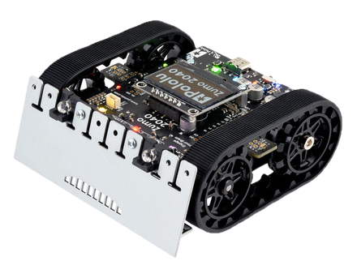
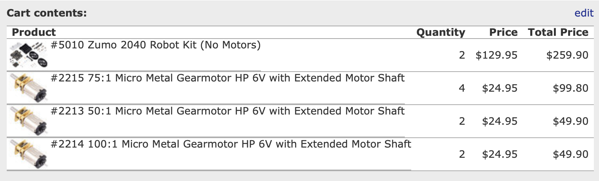
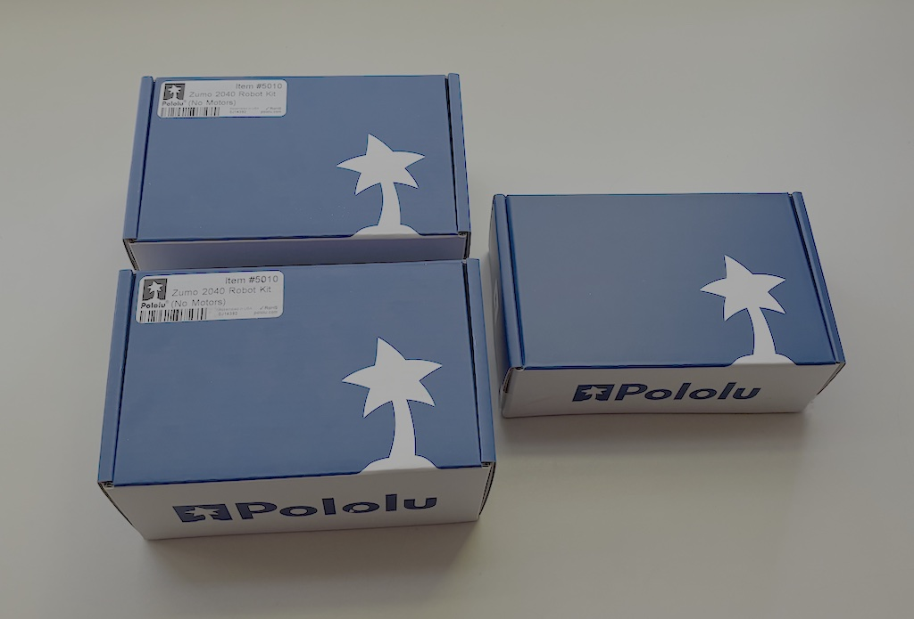
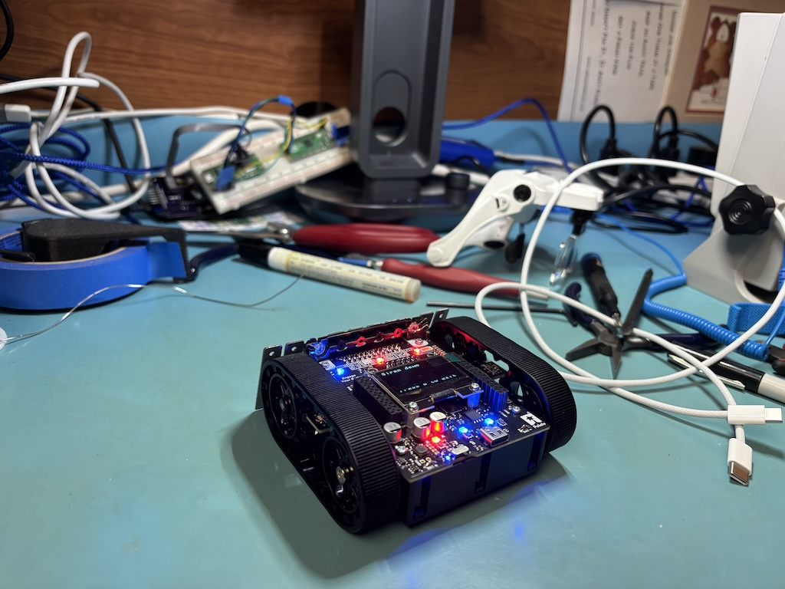
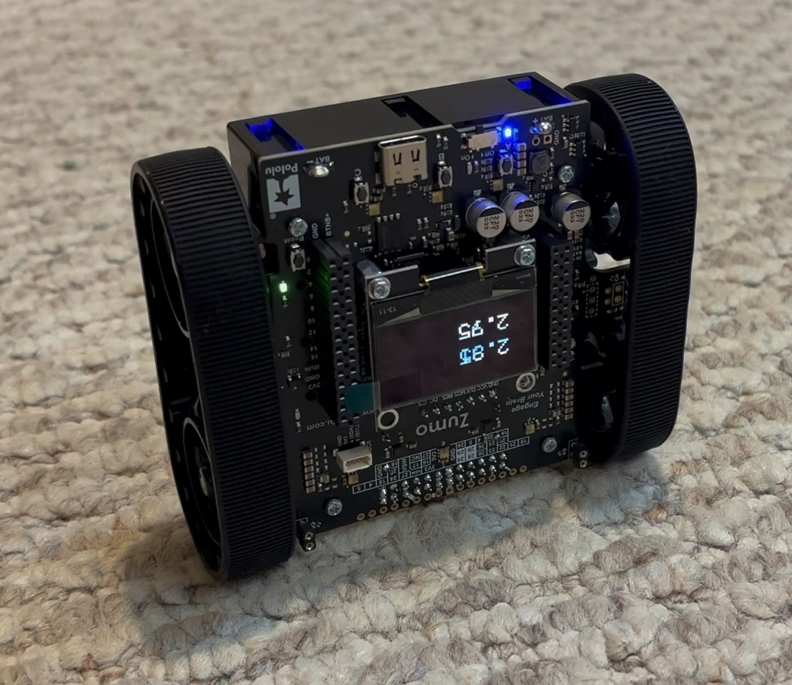
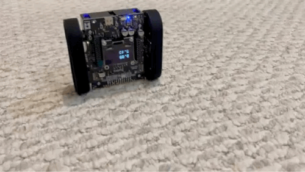
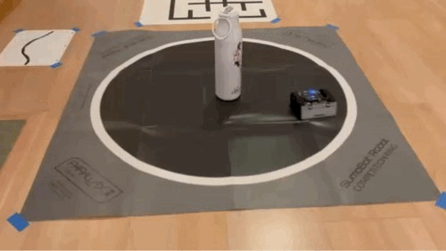
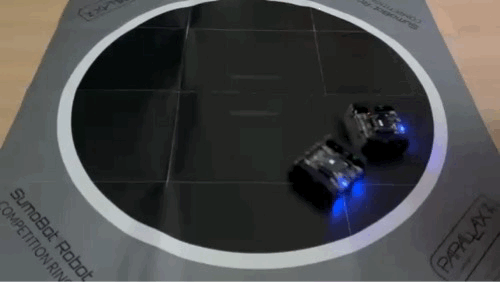
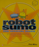
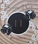

# My Zumo 2040 Challenge Bots
A place to store code for my entrant(s) in [The Zumo 2040 Challenge](https://github.com/adamgreen/zumo-2040-challenge#readme).

## My Pololu Zumo 2040 Bots
### Bot Order

I ordered enough parts from Pololu on June 7, 2026 to build two [Zumo 2040 robots](https://www.pololu.com/product/5010) with the challenge required [75:1 Micro Metal HP Gearmotors](https://www.pololu.com/product/2215). This will allow me to conduct test matches with my various firmware variations.

I also ordered some additional motors with alternate gear ratios to experiment with those in the future as well:
* [50:1 Micro Metal HP Gearmotors](https://www.pololu.com/product/2213)
* [100:1 Micro Metal HP Gearmotors](https://www.pololu.com/product/2214)

### Bot Build

I finished building the first Zumo robot kit (shown above) on June 12th, 2026, the day after I received my order from Pololu.

I later built the second Zumo robot kit (shown below) on June 26th, 2026. This robot was initially constructed without the blade attached to the front of the robot to allow the [Balancing Example](https://github.com/adamgreen/zumo-2040-arduino-library/blob/main/examples/Balancing/Balancing.ino) to perform its magic. I later finished the build for this bot on July 5th and attached its front sensor array and blade as well. Now I can compete one bot against the other.

## Zumo 2040 Arduino Library
I ported my [3π+ 2040 Arduino Library](https://github.com/adamgreen/pololu-3pi-plus-2040-arduino-library) to the **Zumo 2040**. This required:
* Removing support for the 3π+'s Bumper Sensors.
* Adding support for the Zumo's Proximity Sensors.
* Updating the various [examples](https://github.com/adamgreen/zumo-2040-arduino-library/tree/main/examples) to work on my Zumo 2040 bots.

This port can be found here: [Zumo 2040 Arduino Library](https://github.com/adamgreen/zumo-2040-arduino-library)

**Balancing.ino** 

**SumoCollisionDetection.ino** 

## Initial Bouts
I used my recently released [Zumo 2040 Arduino Library](https://github.com/adamgreen/zumo-2040-arduino-library) to compile and build 3 initial Sumo firmware images:
* [SumoCollisionDetect](https://github.com/adamgreen/zumo-2040-arduino-library/blob/main/examples/SumoCollisionDetect/SumoCollisionDetect.ino) - An example from the Pololu Zumo Arduino Library which uses the accelerometer to detect contact with the opponent.
* [SumoProximitySensors](https://github.com/adamgreen/zumo-2040-arduino-library/blob/main/examples/SumoProximitySensors/SumoProximitySensors.ino) - An example from the Pololu Zumo Arduino Library which uses the IR proximity sensors to detect the opponent.
* [alpha](https://github.com/adamgreen/zumo-code/blob/main/software/alpha/alpha.ino) - My Arduino port of Parallax's `SumoBot-5.1-Basic-Competition-Program` firmware which uses the IR proximity sensors to detect the opponent.

I ran each of these 3 firmware images on each of my 2 Zumo robots to create a total of 6 contestants:
* SumoCollisionDetect-A (**coll-a**)
* SumoCollisionDetect-B (**coll-b**)
* SumoProximitySensors-A (**prox-a**)
* SumoProximitySensors-B (**prox-b**)
* **alpha-a**
* **alpha-b**

Each of the resulting 9 matchups were conducted as the best of 3 matches. The scores for each matchup are recorded in the table below in **Row-Colum** format, indicating the number of matches won by the contestant named on the current row vs the number won by the contestant named on the current column:

|         | coll-b | prox-b | alpha-b |
|---------|--------|--------|---------|
| coll-a  | 0-2    | 0-2    | 2-0     |
| prox-a  | 1-2    | 2-0    | 2-0     |
| alpha-a | 2-1    | 0-2    | 2-0     |

### Results
* **First Place**: **prox** - Won **4** out of its 6 matchups.
* **Second Place**: **coll** - Won **3** out of its 6 matchups.
* **Third Place**: **alpha** - Won **1** out of its 6 matchups.
* **Robot A**: Won **5** matchups.
* **Robot B**: Won **4** matchups.

### Notes
* The **alpha** firmware has an issue where it gets stuck with its back to the ring border.
* The second match in the **prox-a** vs **coll-b** matchup was interesting. The winner, **prox-a**, contacted the loser, **coll-b**, on the back corner with its blade enabling it to get under the bot and lift it up on its side. 

## Reading List
| | |
|-|-|
|  | [Robot Sumo by Pete Miles](https://www.amazon.com/Robot-Sumo-Official-Pete-Miles/dp/007222617X) |
|  | [Parallax SumoBot - Mini-Sumo Robotics](https://www.parallax.com/package/sumobot-manual-downloads/) |
